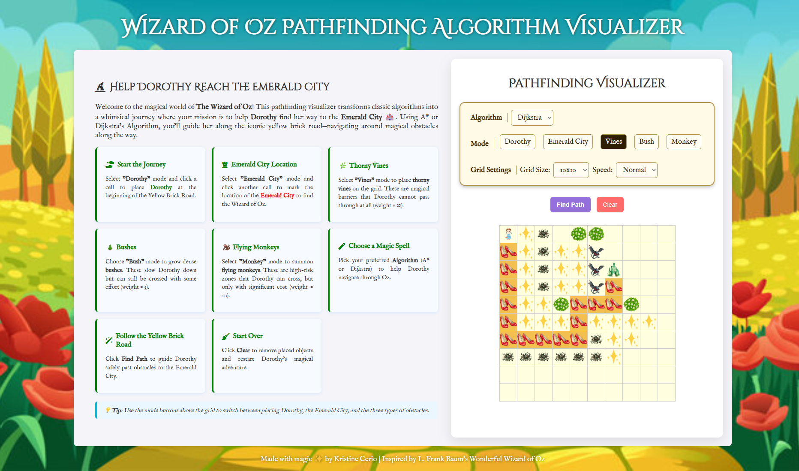

# 🧙‍♀️ Web-Based Interactive Pathfinding Algorithm Visualizer

**Help Dorothy reach the Emerald City** in this fun and educational pathfinding visualizer! This web app allows users to explore how popular algorithms like **Dijkstra’s** and **A\*** work by navigating a grid full of magical obstacles like thorny vines, bushes, and flying monkeys—all styled with a whimsical *Wizard of Oz* theme.

<div align="center">
  
</div>


---

## ✨ Features

* 🟩 **Interactive Grid**: Click to place Dorothy (start), the Emerald City (end), and various obstacles.
* 🛤️ **Algorithms**: Choose between:

  * **Dijkstra’s Algorithm**: Finds the shortest path without heuristics.
  * **A\* Algorithm**: Uses heuristics for faster pathfinding.
* 🌱 **Weighted Obstacles**:

  * **Thorny Vines**: Impassable (infinite weight).
  * **Bushes**: Slows path (weight = 5).
  * **Flying Monkeys**: Heavy danger zone (weight = 10).
* ⚙️ **Customizable Settings**:

  * Grid size: 10x10, 15x15, or 20x20
  * Speed control: Fast, Normal, Slow
* 🎨 **Thematic Visual Design**: Inspired by L. Frank Baum’s *The Wonderful Wizard of Oz*.

---

## 🕹️ How to Use

1. **Select a Mode**:

   * 🎒 `Dorothy`: Click on a grid cell to place the start node.
   * 🏰 `Emerald City`: Click to set the destination.
   * 🌿 `Vines`: Place impassable obstacles.
   * 🌳 `Bushes`: Place weighted terrain (weight 5).
   * 🐒 `Monkeys`: Place heavier terrain (weight 10).

2. **Choose an Algorithm**:

   * Use the dropdown menu to pick between Dijkstra or A\*.

3. **Click "Find Path"**:

   * Watch the algorithm search for the shortest path!

4. **Click "Clear"**:

   * Resets the grid to start a new journey.

---

## 🛠️ Tech Stack

* **HTML/CSS/JavaScript** – Core technologies for layout, interactivity, and animations
* **Font Awesome** – For magical icons
* **Google Fonts** – Themed typography for a storybook feel

---

## 📁 Folder Structure

```bash
/
├── images             # folder containing images used in the web-app
├── index.html         # Main app layout and logic triggers
├── style.css          # Styling for the grid, buttons, and animations
├── pathfinding.js     # Dijkstra & A* implementation + DOM manipulation
├── README.md          # You’re here!
```

---

## 🎯 Educational Goals

This visualizer is perfect for:

* CS students learning pathfinding algorithms
* Teachers demonstrating algorithm behavior
* Anyone who enjoys algorithm visualization with a magical twist

---

## 📸 Screenshots

> Add screenshots or a screen recording here for visual impact.

---

## 🧙‍♂️ Credits

Made with magic ✨ by **Kristine Cerio**
Inspired by L. Frank Baum’s *The Wonderful Wizard of Oz*

